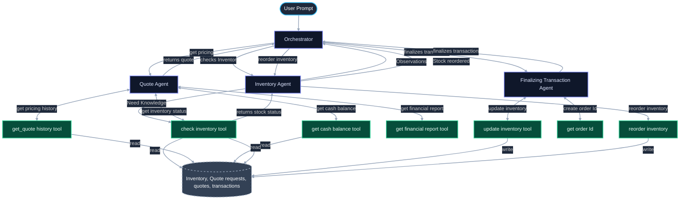

```mermaid
%%{init: {'theme': 'dark', 'themeVariables': { 'lineColor': '#38bdf8', 'primaryTextColor': '#f8fafc', 'edgeLabelBackground': '#1e293b'}}}%%
flowchart TD
    %% Styling Definitions
    classDef startend fill:#1e293b,stroke:#38bdf8,stroke-width:2px,color:#fff
    classDef agent fill:#0f172a,stroke:#818cf8,stroke-width:2px,color:#e0e7ff
    classDef decision fill:#312e81,stroke:#a78bfa,stroke-width:2px,color:#fff
    classDef tool fill:#064e3b,stroke:#34d399,stroke-width:2px,color:#ecfdf5
    classDef human fill:#78350f,stroke:#fbbf24,stroke-width:2px,color:#fef3c7
    classDef memory fill:#334155,stroke:#94a3b8,stroke-width:2px,stroke-dasharray: 5 5,color:#f8fafc

    %% Force High-Visibility Arrows
    linkStyle default stroke:#94a3b8,stroke-width:2px

    %% Legend Box
    %%subgraph Legend ["📌 Diagram Legend"]
    %%    direction TB
    %%    L1([Start / End]):::startend
    %%    L2[LLM / Agent Node]:::agent
    %%    L3{Routing / Gate}:::decision
    %%    L4[Tool / RAG Action]:::tool
    %%    L5[Human Guardrail]:::human
    %%    L6[(State / Memory)]:::memory
    %%end
    %%style Legend fill:#0f172a,stroke:#475569,stroke-width:1px,color:#cbd5e1

    %% Main Workflow Nodes
    Start([User Prompt]):::startend
    DB[(Inventory, Quote requests, quotes, transactions)]:::memory

    %% Agent
    Orchestrator[Orchestrator]:::agent
    Inventory_Agent[Inventory Agent]:::agent
    Quote_Agent[Quote Agent]:::agent
    Finalizing_Transaction_Agent[Finalizing Transaction Agent]:::agent
    %% Decision
    %%Enough_Stock{Enough stock?}:::decision
    %%Fullfillment_Plan{In Stock or partially in %%stock or delayed }:::decision
    %%Quote_accepted{User accepted quote?}:::decision
    %% Tools
    get_inventory_report[check inventory tool]:::tool
    get_quote_history[get_quote history tool]:::tool
    get_cash_balance[get cash balance tool]:::tool
    get_financial_report[get financial report tool]:::tool
    update_inventory[update inventory tool]:::tool
    get_orderId[get order Id]:::tool
    reorder_inventory[reorder inventory]:::tool

    %% Flow Connections
    Start --> Orchestrator

    Orchestrator --> |checks Inventor| Inventory_Agent
    Inventory_Agent -->|Need Knowledge| get_inventory_report
    get_inventory_report -->|read| DB
    get_inventory_report -->|returns stock status| Inventory_Agent
    Inventory_Agent -->|Observations| Orchestrator
    Orchestrator --> |get pricing| Quote_Agent
    Quote_Agent <--> |get pricing history| get_quote_history
    get_quote_history -->|read| DB

    Quote_Agent <--> |get cash balance| get_cash_balance
    get_cash_balance -->|read| DB

    Quote_Agent <--> |get inventory status| get_inventory_report
    get_inventory_report -->|read| DB

    Quote_Agent <--> |get financial report| get_financial_report
    Quote_Agent --> |returns quote| Orchestrator
    Orchestrator --> |finalizes transaction| Finalizing_Transaction_Agent
    Finalizing_Transaction_Agent <--> |create order Id| get_orderId
    Finalizing_Transaction_Agent <--> |update inventory| update_inventory
    update_inventory -->|write| DB
    Finalizing_Transaction_Agent --> |finalizes transaction| Orchestrator
    %% Orchestrator call inventory agent to reoder stock if necessary
    Orchestrator --> |reorder inventory| Inventory_Agent
    Inventory_Agent --> |reorder inventory| reorder_inventory
    reorder_inventory -->|write| DB

    Inventory_Agent --> |Stock reordered| Orchestrator

```
