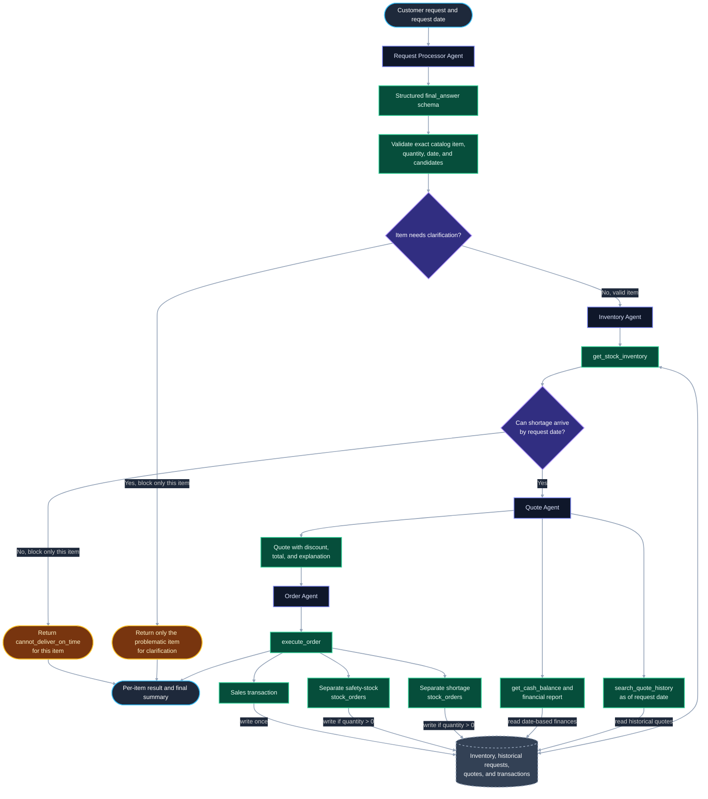

```mermaid
%%{init: {'theme': 'dark', 'themeVariables': { 'lineColor': '#38bdf8', 'primaryTextColor': '#f8fafc', 'edgeLabelBackground': '#1e293b'}}}%%
flowchart TD
    classDef startend fill:#1e293b,stroke:#38bdf8,stroke-width:2px,color:#fff
    classDef agent fill:#0f172a,stroke:#818cf8,stroke-width:2px,color:#e0e7ff
    classDef decision fill:#312e81,stroke:#a78bfa,stroke-width:2px,color:#fff
    classDef tool fill:#064e3b,stroke:#34d399,stroke-width:2px,color:#ecfdf5
    classDef human fill:#78350f,stroke:#fbbf24,stroke-width:2px,color:#fef3c7
    classDef memory fill:#334155,stroke:#94a3b8,stroke-width:2px,stroke-dasharray: 5 5,color:#f8fafc

    linkStyle default stroke:#94a3b8,stroke-width:2px

    Request([Customer request and request date]):::startend
    Result([Per-item result and final summary]):::startend
    Clarification([Return only the problematic item<br/>for clarification]):::human
    Late([Return cannot_deliver_on_time<br/>for this item]):::human
    DB[(Inventory, historical requests,<br/>quotes, and transactions)]:::memory

    Processor[Request Processor Agent]:::agent
    StructuredFinal[Structured final_answer schema]:::tool
    Validate[Validate exact catalog item,<br/>quantity, date, and candidates]:::tool
    ClarificationGate{Item needs clarification?}:::decision

    InventoryAgent[Inventory Agent]:::agent
    StockTool[get_stock_inventory]:::tool
    OnTimeGate{Can shortage arrive<br/>by request date?}:::decision

    QuoteAgent[Quote Agent]:::agent
    HistoryTool[search_quote_history<br/>as of request date]:::tool
    FinanceTools[get_cash_balance and<br/>financial report]:::tool
    Pricing[Quote with discount,<br/>total, and explanation]:::tool

    OrderAgent[Order Agent]:::agent
    ExecuteOrder[execute_order]:::tool
    ShortageOrder[Separate shortage<br/>stock_orders]:::tool
    SafetyOrder[Separate safety-stock<br/>stock_orders]:::tool
    Sale[Sales transaction]:::tool

    Request --> Processor
    Processor --> StructuredFinal
    StructuredFinal --> Validate
    Validate --> ClarificationGate

    ClarificationGate -->|No, valid item| InventoryAgent
    ClarificationGate -->|Yes, block only this item| Clarification

    InventoryAgent --> StockTool
    StockTool <--> DB
    StockTool --> OnTimeGate

    OnTimeGate -->|No, block only this item| Late
    OnTimeGate -->|Yes| QuoteAgent

    QuoteAgent --> HistoryTool
    HistoryTool -->|read historical quotes| DB
    QuoteAgent --> FinanceTools
    FinanceTools -->|read date-based finances| DB
    QuoteAgent --> Pricing
    Pricing --> OrderAgent

    OrderAgent --> ExecuteOrder
    ExecuteOrder --> ShortageOrder
    ExecuteOrder --> SafetyOrder
    ExecuteOrder --> Sale
    ShortageOrder -->|write if quantity > 0| DB
    SafetyOrder -->|write if quantity > 0| DB
    Sale -->|write once| DB
    ExecuteOrder --> Result
    Clarification --> Result
    Late --> Result
```
